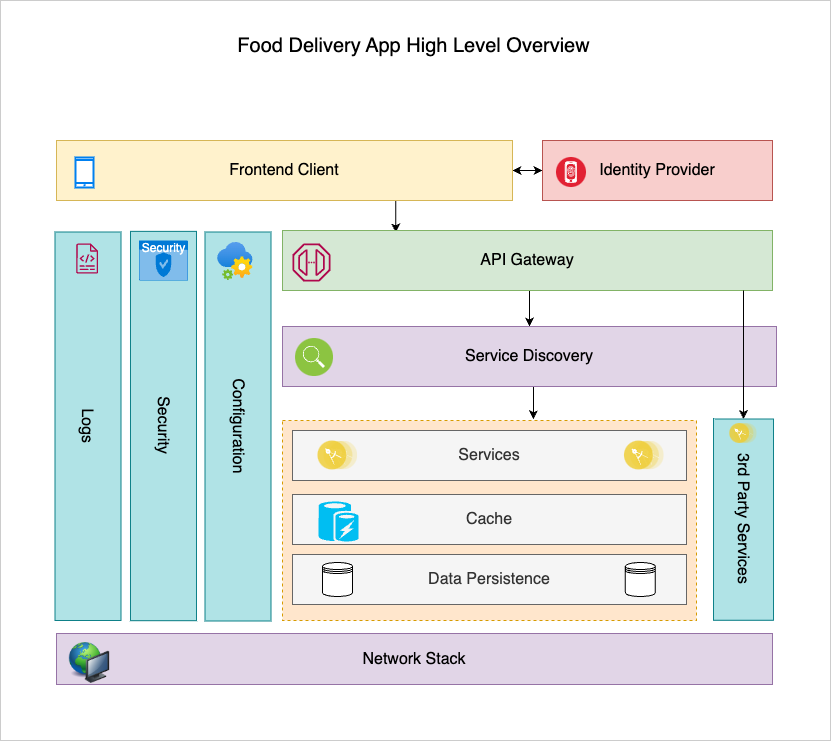

# BITS Scalable Services Assignment 1

## Team

-   KOLAMALA RAMESH - 2023mt93294[@]wilp.bits-pilani.ac.in

## Services

-   [Auth Service](./auth-service)
-   [Customer Service](./customers-service)
-   [Restaurant Service](./restaurant-service)
-   [Order Service](./order-service)

## Assignment:

1. Create a Microservices based application with 3 to 4 microservices. Each service should be maintained as a separate code repository so that it can be developed, deployed, and tested independently.
2. Use a suitable database and database related pattern for these services.
3. Use a suitable approach for the communication between these services.
4. Add a security layer to authenticate the services using Oauth/Tokens (optional)
5. Deploy the application using Docker/Kubernetes (optional)
   Submission details:
   a) Submit elaborate documentation with group details, contribution by each group member, brief application description, the architecture of your application, steps, and screenshot for each of the above-mentioned tasks. Also, provide a link to the GitHub repositories in the document.
   b) Create the first demo video to explain your microservices, the database, and communication between the services (for points 1,2, and 3)
   c) Create the second video to show a demo about security and deployment (for points 4 and 5)

## Tech Stack

-   Node.js
-   PostgreSQL
-   Postman

## Design Choices, Role-Based Access, and Data Security

## Key Design Choices

-   **1. Scalability**
    The architecture of the Food Delivery Application is designed with scalability as a primary goal. Each service in the application is developed as an independent microservice, enabling horizontal scaling. This ensures that specific components, such as the Authentication or Customer Service, can scale independently based on demand without impacting other services.

-   **2. Modularity**
    The system adheres to modular principles, dividing functionalities into distinct services:

Authentication Service: Manages user registration, login, and authentication.
Customer Service: Handles customer-specific operations, such as viewing restaurants and placing orders.
Restaurant Service: Allows restaurant owners to manage menus, food items, and order processing.
Delivery Agent Service: Provides delivery agents with tools to track and complete deliveries.
Admin Service: Oversees platform management, including user roles and system monitoring.

-   **3. Separation of Concerns**
    Each service is responsible for a single domain of functionality, promoting cleaner code, reduced coupling, and easier maintenance. Services communicate with each other using RESTful APIs, ensuring clear boundaries and decoupled interactions.

-   **4. REST-Based Communication**
    Inter-service communication is based on REST APIs, allowing standardized, lightweight, and widely understood communication patterns. This ensures that microservices can interact seamlessly.

-   **5. Prisma**
    Prisma is employed as the Object-Relational Mapping (ORM) tool for efficient and type-safe interaction with the PostgreSQL database. It simplifies schema management and accelerates development.

## Role-Based Access Control (RBAC)

-   **Roles and Access**
    The application implements a robust Role-Based Access Control (RBAC) system to ensure restricted access to specific resources and operations. The following roles are defined:

-   **Customer:** Access to browse restaurants, view menus, and place orders.
-   **Restaurant Owner:** Access to manage restaurant details, add food items, and handle incoming orders.
-   **Delivery Agent:** Access to view assigned deliveries and update delivery statuses.
-   **Admin:** Full access to manage users, assign roles, and oversee system functionality.
    Implementation
-   **Role Assignment:** User roles are assigned during registration or by the admin. These roles are stored in the database alongside user information.
    Access Control Enforcement: Middleware validates user roles and ensures only authorized roles can access specific routes. For example:
    Customers cannot access restaurant management endpoints.
    Delivery agents are restricted to delivery-related endpoints.
-   **Route Protection:**
    JWTs (JSON Web Tokens) are used to authenticate users.
    The payload of the JWT includes user information and roles, which are validated on each request.
    Example Middleware Snippet:
    javascript
    Copy code
    const verifyRole = (allowedRoles) => (req, res, next) => {
    const userRole = req.user.role;
    if (!allowedRoles.includes(userRole)) {
    return res.status(403).json({ message: 'Access denied' });
    }
    next();
    };

## Data Security

-   **1. JWT Authentication**
    Authentication is stateless and secure, using JSON Web Tokens (JWT). Upon successful login, a signed JWT is issued to the user, containing:

User ID
Role
Expiry information
The token is validated on each request, ensuring secure access to APIs without requiring session storage.

-   **2. Secure Communication**
    All inter-service communication occurs over HTTPS to prevent data interception.
    Sensitive data, such as passwords, is hashed using algorithms like bcrypt before storage.
-   **3. Role Validation**
    API endpoints are secured by validating user roles embedded in the JWT. For example, only users with the role admin can access admin-specific routes.

-   **4. Prisma and Database Security**
    Prisma provides a layer of abstraction over the PostgreSQL database, ensuring safe and efficient query execution.
    Access to the database is secured using strict connection policies and credentials management.

## Inter-Service Communication

-   **Implemented REST-based synchronous communication** between:
    -   **Customer Service** and **Order Service**
    -   **Restaurant Service** and **Order Service**
    -   **Customer Service** and **Restaurant Service**

### Technologies Used

-   **Node.js**: For building the backend microservices.
-   **Express.js**: For building RESTful APIs.
-   **Axios**: For making HTTP requests between services.

This communication setup ensures efficient and seamless interaction between the microservices while maintaining modularity and scalability.

-   **App demo:** [Video Link]()

## Demo video url

-   **App demo:** [Video Link]()

## Git repo

https://github.com/RameshLgg3/scalable-services-assignment

## API Documentation

https://documenter.getpostman.com/view/37944880/2sAYBREtTW

## Architecture

